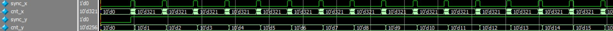
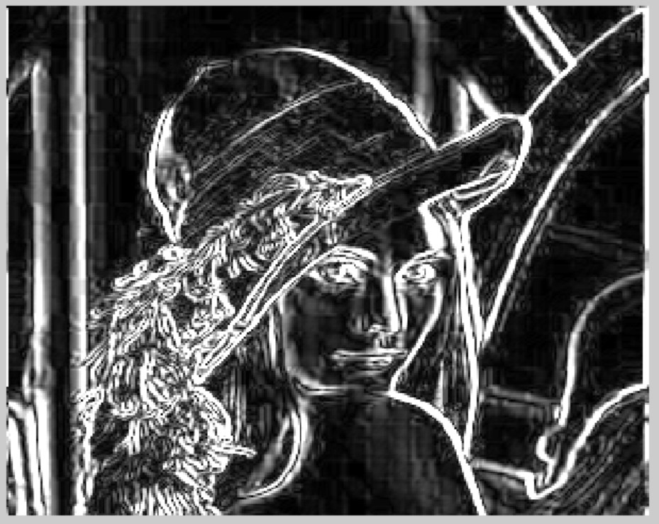

# 基于FPGA的Sobel算法实现

第一次写这种技术博客，发现整理清楚思路，把想法清楚的表达出来还是挺困难的。在努力表达清楚的过程中，发现觉得逻辑不太清晰的原因可能是自己的理解根本就没有深入。这篇博文是自己2019年的第一个Flag，自己要立好了！

---

在基于FPGA的图像处理算法中，对于算法实现的验证有两种方法：

- 使用显示器
- 使用matlab

## Matlab图像处理平台搭建

这个小标题起的有点大，其实跟图像算法没有什么关系，不过是利用MATLAB生成图像数据、使用verilog读入数据提供源数据、再使用MATLAB读入modelsim中产生的输出数据，最后显示。

基本思路是：

把一副图片转换为320x256分辨率的灰度图片，然后利用`fprintf`函数把图像矩阵写入txt文件。

这个m文件涉及到的函数都很简单，写的时候一遍看help，一遍运行着看结果对不对。MATLAB源码如下：

```matlab
% /*-----------------------------------------------------------------------
% CONFIDENTIAL IN CONFIDENCE
% This confidential and proprietary software may be only used as authorized
% by a licensing agreement from zjl ().
% In the event of publication, the following notice is applicable:
% Copyright (C) 2013-20xx zjl Corporation
% The entire notice above must be reproduced on all authorized copies.
% Author				:		zjl
% Technology blogs 	:       
% Email Address 		: 		i540113104@gmail.com
% Filename			:		.m
% Data				:		2018-12-30
% Description			:		1.可以输入任意尺寸的图片，输出图片分辨率为320x256
%                               2.输出rgb、灰度图像
%                               3.生成txt文件，在modelsim仿真时使用
%                               4.生成mif文件，在例化IP核时使用
% Modification History	:
% Data			By			Version			Change Description
% =========================================================================
% 30/12/18		zjl			  1.0				Original
% -----------------------------------------------------------------------*/

clc
clear all
close all

img_ori = imread('lena.jpg');%加载图像
img_320x256 = imresize(img_ori,[256,320]);% 把图片转换为320x256分辨率
img_320x256_gray = rgb2gray(img_320x256);%图像转换为灰度图像

imwrite(img_320x256_gray,'lena_gray_320x256.jpg');

% ---------------------------------------------------------------------------
figure(1)
subplot(1,3,1),imshow(img_ori);
subplot(1,3,2),imshow(img_320x256);
subplot(1,3,3),imshow(img_320x256_gray);
% ---------------------------------------------------------------------------
%320*256大小的灰度图像生成TXT文档
fid = fopen('./lena.txt','wt');%打开空文件
for i = 1 : size(img_320x256_gray, 1)%行循环
    for j = 1 : size(img_320x256_gray, 2)%列循环
        fprintf(fid, '%d ', img_320x256_gray(i, j));%每个数据之间用空格分开%
    end
    fprintf(fid, '\n');%文件末尾加一个换行
end
fid = fclose(fid);%关闭文件
I_data = load('./lena.txt');%加载txt文件到matlab工作区-可不要

% ---------------------------------------------------------------------------
%生成mif文件
[m,n] = size( img_320x256_gray );% m行 n列
N = m*n;                               %%数据的长度，即存储器深度。
word_len = 8;                          %%每个单元的占据的位数，需自己设定
data = reshape(img_320x256_gray', 1, N);% 把矩阵转换为1行N列
 
fid=fopen('gray_image.mif', 'w');       %打开文件
fprintf(fid, 'DEPTH=%d;\n', N);         %存储器深度
fprintf(fid, 'WIDTH=%d;\n', word_len);  %存储器位宽
fprintf(fid, 'ADDRESS_RADIX = UNS;\n'); %% 指定address为十进制
fprintf(fid, 'DATA_RADIX = HEX;\n');    %% 指定data为十六进制
fprintf(fid, 'CONTENT\t');
fprintf(fid, 'BEGIN\n');
for i = 0 : N-1
    fprintf(fid, '\t%d\t:\t%x;\n',i, data(i+1));
end
fprintf(fid, 'END;\n');                 %%输出结尾
fclose(fid);                            %%关闭文件
```


实现verilog读入文本数据也很简单，一个`$readmemh`即可，然后在行同步信号的有效期内在时钟边沿读入寄存器。

```verilog
//*任务：读取文件到内存
task load_data2mem;
begin
	$readmemh("lena.txt",reg_mem);
end
endtask

always @ (posedge clk)begin
	if(!rst_n) begin
		addr <= 0;
	end
	else if( sync_x )begin
		addr <= addr +1;
	end
end
assign data_tmp = reg_mem[addr];//从内存中读出数据
```


仿真波形如下图所示：




> 注意:因为是在testbench中产生数据的，所以可以使用延时语句让行有效信号严格对齐数据，这样更容易实现。


### 数据写入文件，在matlab中进行显示

verilog操作文本的函数比较多，`$display`就够用了。

```matlab
//----------------------系统函数------------------------
//将仿真数据o_data写入外部TXT文件中(x1.txt)
integer file_df;
initial begin
	//文件放置在"工程目录\simulation\modelsim"路径下
	file_df = $fopen("x1.txt");
	if(!file_df)begin
		$display("could not open file!");
		$finish;
	end
end
always @(posedge clk) begin
	if( data_valid )//一帧图像数据
		$fdisplay(file_df,"%d",out);
end
```


最后一步是MATLAB读入仿真数据，显示图片

```matlab
% /*-----------------------------------------------------------------------
% CONFIDENTIAL IN CONFIDENCE
% This confidential and proprietary software may be only used as authorized
% by a licensing agreement from zjl ().
% In the event of publication, the following notice is applicable:
% Copyright (C) 2013-20xx zjl Corporation
% The entire notice above must be reproduced on all authorized copies.
% Author				:		zjl
% Technology blogs 	:       
% Email Address 		: 		i540113104@gmail.com
% Filename			:		.m
% Data				:		2018-12-30
% Description			:		1.读入tb文件中生成的txt文件;
%                               2.txt文件中的数据可以是十进制、也可以是十六进制，在tb中设置;
%                               3.使用imshow函数显示仿真数据的时候有个坑，数据导入matlab后，查看数据范围是0~255，但是数据类型与imshow函数使用的不同，直接使用imshow(img)的时候，imshow会多余的处理数据，处理结果就是：大于0的像素认为该点灰度为1，否则为零，直观的观察就是窗口像是图像为纯白色;
% Modification History	:
% Data			By			Version			Change Description
% =========================================================================
% 30/12/18		zjl			  1.0				Original
% -----------------------------------------------------------------------*/


% fid = fopen('./x1.txt','rt');
fid = fopen('./lena.txt','rt');
img_tmp=fscanf(fid,'%x',inf);%以十进制数据读入数据到matlab工作区
% img_tmp2 = reshape(img_tmp, 254,320);% 1行N列
% img_tmp3 = imresize(img_tmp2,[256,320]);
% img_tmp4 = round(img_tmp3);
% img_320x256=uint8(img_tmp3);
p=1;
for i = 1 : 254			%行数，取决于生成的txt文件像素数目
	for j = 1 : 320		%列数，设置为固定吧
        img_tmp2(i,j) = img_tmp(p);
		p=p+1;
    end
end
fclose(fid);
figure(1)
imshow(img_tmp2,[]);	%! 注意：加上[]配置函数自动处理数据类型
% imwrite(uint8(img_320x256),'file_out.tif')
% imshow(img_320x256);

```


显示图片有个比较坑的地方是，最后使用`imshow`函数显示图片的时候，要使用`imshow(mat,[])`来把数据调整到合适的灰度值范围内，否则直接现实的话会出现整帧图像全是白色的诡异图像（诡异的地方是matlab工作区的变量显示的取值范围就是0~255，我猜测是imshow函数在处理数据的时候把所有的数据判断为255，但是原因是什么还不清楚）。

下面两个图是verilog输入输出数据的图像显示。





## 行缓冲器的verilog实现

盗用一下altera-ip-shift-register-usermanual中的一个图。


---

未完待续……

